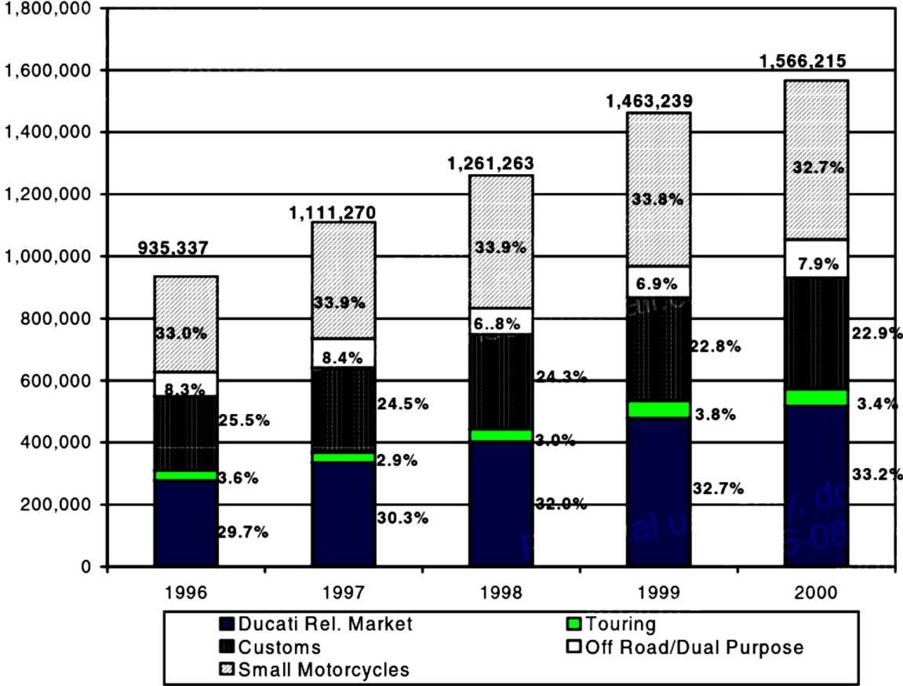
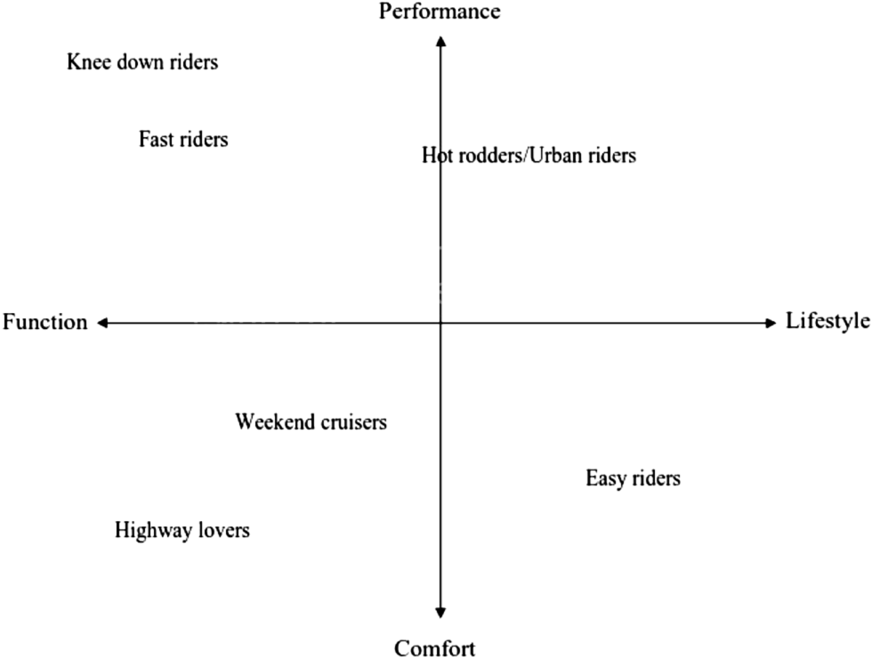
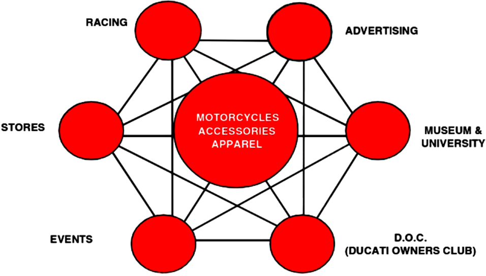
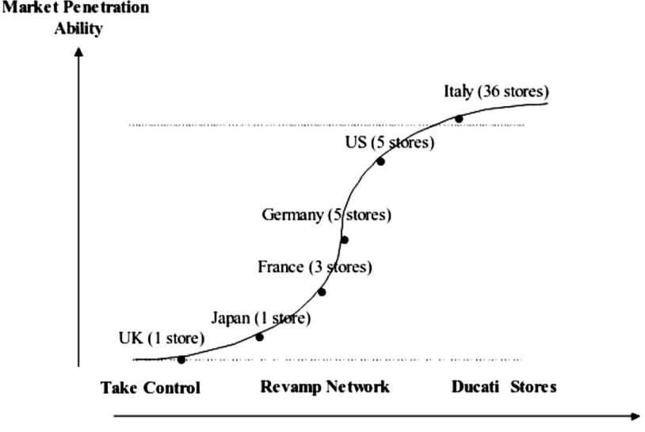
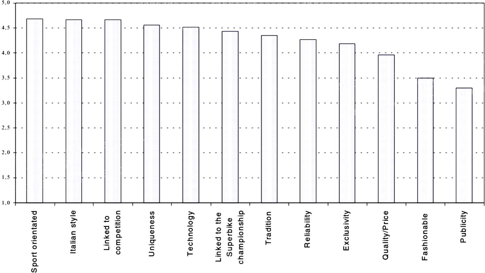
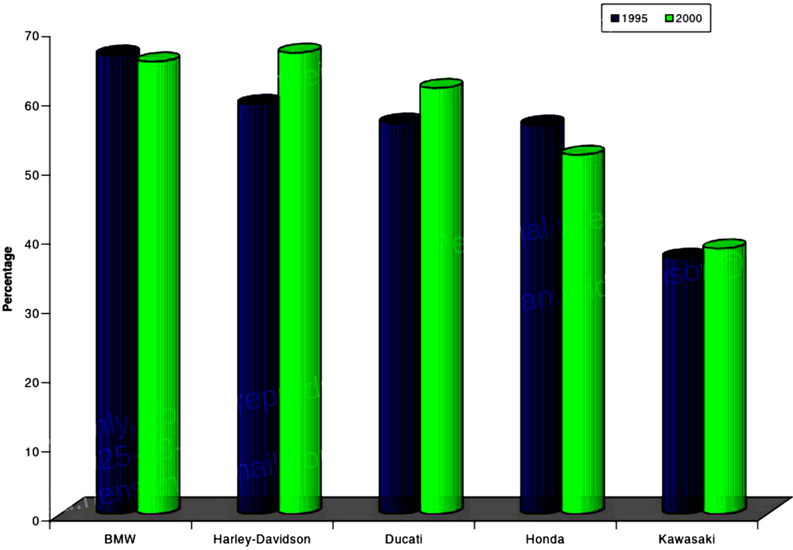

# Ducati

By the end of 2000, Federico Minoli had won his battle. Over the past five years, the "turnaround artist," as *Forbes* magazine dubbed him, had transformed a company on the verge of bankruptcy into one of the most profitable motorcycle manufacturers in the world; a mechanical concern into a global brand; a fast motorcycle into a symbol of Italian design, tradition, extreme performance, and technical excellence. Under Minoli, Ducati had enjoyed explosive growth and profitability. Revenues had quadrupled since 1996; EBITDA had grown from 33.4 million Euros in 1997 to around 60.0 million Euros in 2000; the market share had gone from 5.1% in the sport bikes segment in 1997 to 6.7% in 2000 (see Exhibit 1).

Despite this success, Minoli was concerned with the future of the company. He knew that Ducati could not grow indefinitely and was struggling with what might overtake these bounds. Minoli and the rest of Ducati’s management team were considering different alternatives. One alternative was to attack Harley-Davidson’s niche with a Ducati interpretation of a cruiser. Was this broadening of Ducati’s traditional niche the right move to sustain the profitable growth of the company?

## The Market for Motorcycles in 2001

The roots of the motorcycle industry date back to 1868, when Louis Perraux installed a steam engine on a rudimentary bicycle. In 1894, the Hildebrand brothers and Alois Wolfmüller produced the first motorcycle with an internal-combustion, two-cylinder gasoline engine. The motorcycle quickly became a cultural icon. As T. Krens, the curator of *The Art of the Motorcycle* exhibition at the Guggenheim Museum, stated:

> The motorcycle is a metaphor for the twentieth century. Invented at the beginning of the industrial age, its evolution tracks the main currents of modernity. The object and its history represent the themes of technology, engineering, innovation, mobility, speed, rebellion, desire, freedom, love, sex, and death. Park the latest Ducati, Honda, or BMW on a street corner in any city or town in the world, and a crowd will gather, drawn to its perfect design.

## Products

Approximately 1.6 million motorcycles were sold around the world in 2001 (see Exhibit 2). Industry experts divided the market for large-displacement motorcycles into four segments: off-road, cruisers, touring, and sport bikes. The off-road segment typically included both motorcycles for purely off-road use and motorcycles designed for both on-road and off-road use (dual-purpose bikes). These motorcycles were characterized by upright ergonomics, thickly padded seats, soft shocks, and superior sturdiness. The largest players within this segment were all of the Japanese manufacturers, KTM, BMW, and Husqvarna. Cruisers were motorcycles with an upright position, emphasizing styling over comfort and speed, and were preferred by many American riders. Harley-Davidson dominated this segment, while Japanese companies such as Suzuki and Kawasaki imitated the traditional style. In 1997, BMW introduced its own interpretation of a cruiser, which enjoyed stunning commercial success. Touring bikes were larger motorcycles equipped for longer rides and greater comfort. Within this segment, the three largest players were BMW, Harley-Davidson, and Honda. Sport bikes had lighter frames, a more forward-seated position, and emphasized speed, acceleration, and minimal comfort. This niche, which Ducati identified as its relevant market (see Exhibit 3), could be further disaggregated into four sub-segments: hyper-sport (extreme performance, closely derived from racing, with superior handling and low weight), naked (good performance and urban riding), super-sport (speed and handling), and sport-touring (speed and handling married with comfort for longer rides). Japanese companies dominated this niche, while European firms such as Ducati, BMW, and Triumph also vied for market share. Harley-Davidson entered the sport bike market by acquiring Buell Motorcycles in 1998. This segment was Ducati’s reference market.

## Customers

A wide variety of individuals, with equally different tastes, bought and rode motorcycles (see Exhibit 4). Aficionados sought extreme performance, functionality, reliability, and technical excellence. "Easy-riders," at the other extreme, associated the motorcycle with a particular lifestyle. "Weekend riders" and "highway lovers" were more interested in attributes like functionality and comfort, while a portion of undecided bikers preferred a more balanced and versatile bike. Each customer type differed by age, income, education, and gender. For instance, the median age for a Harley-Davidson customer in 2000 was 46 (up from 35 in 1987), while most of Ducati’s buyers, whose median age had consistently decreased in the last few years, ranged between 25 and 35 years old.

Women had become an attractive new customer base for motorcycle manufacturers and were particularly important to some manufacturers like Harley-Davidson and Ducati. Harley’s proportion of female purchasers had increased from 2% in 1987 to 9% in 2000. Ducati claimed that women were attracted by the low seat height and weight of its motorcycles and accounted for 8% of sales of some models of its most popular bike, the Monster.

Specialized magazines, such as *Motorcycle Consumer News*, *Rider*, and *Cycle World*, catered to buyers and educated them about the technical and stylistic characteristics of new products. They tested and ranked new motorcycles on several criteria, such as performance, handling, and overall comfort. Although the majority of motorcycle companies advertised through specialized magazines, only some of them, typically the largest manufacturers, also advertised through the non-specialized press. Motorcycle firms also gained media coverage by participating in racing events. In addition, movies brought cachet to motorcycles. Motorcycles had been featured prominently in Hollywood movies, most notably the Triumph ridden by Marlon Brando in *The Wild One* and the Harleys ridden by Peter Fonda, Dennis Hopper, and Jack Nicholson in *Easy Rider*. Department stores like Bloomingdale’s and Harrods sometimes used motorcycles in their window displays.

## Technology and R&D

From the first 7 mph wooden Daimler Einspur of 1885 to the 171 mph MV Agusta F4 of 1998, motorcycles’ performance, comfort, reliability, and ease of maintenance had improved vastly. These advances ranged from significant innovations, which offered superior performance and distinguished companies’ brands, to stylistic features introduced for little cost by combining modified components from old models. Kawasaki’s 1984 engine, Ducati’s Desmodromic valve management system and L-Twin engine, and BMW’s anti-lock braking system were examples of the former type of innovation. Nevertheless, improvements like paint, trim, chrome, and exhaust pipe shaping were also necessary to appeal to modern bikers, especially when deference to the company’s styling tradition caused innovation to occur incrementally.

Starting in the mid-1970s, the most important trend had been the progressive introduction of electronic components. More recently, advances in materials science led companies to introduce composites—carbonium, titanium, and magnesium—to make their bikes lighter and more reliable. Industry experts estimated that in 2001, in-house R&D expenditures ranged between 2% and 5% of total revenues.

Motorcycles’ technological improvements stemmed from different sources. Manufacturers concentrated on optimizing engine performance while decreasing motorcycles’ weight, as well as improving their aerodynamics to lower fuel consumption and toxic emissions. Suppliers also pushed to improve quality and technology, thus enhancing components like sophisticated “air-assisted” forks, mono-shock rear suspensions, and front and rear disc brakes. Especially since the early 1980s, some major companies like Honda, Kawasaki, Yamaha, and Ducati had also used racing competitions to develop technical solutions, test materials, and eventually transfer effective solutions to their production series. The racing circuit encompassed a number of different competitions, the most important of which were the Grand Prix (with the 125 cc, 250 cc, and 500 cc categories) and the Superbike Championship (with bikes ranging from 750 cc to 1,000 cc). Industry analysts agreed that a recent trend that could be generalized to the entire industry had been a stronger integration between R&D and marketing, which caused a number of technical improvements or innovations to derive from market surveys or customer feedback.

The pace of technological innovation was aided by the advent of CAD and CNC technologies, which greatly helped manufacturers’ efforts in styling, prototyping, and assessing product feasibility.

## Manufacturing

Most motorcycle companies invested heavily to automate production lines and worked with parts suppliers to improve quality and delivery. Only a few firms, such as Triumph, increased their level of vertical integration. Triumph in 2000 outsourced around 58% of its production. As a consequence, most of them had a highly flexible, streamlined production structure. Outsourcing minimized fixed asset investment, but the quest for quality, reduced costs, and responsiveness to market fluctuations forced final assemblers to create strong commitment at the supplier level. For instance, Harley-Davidson established a Supplier Advisory Council (SAC) made up of 16 suppliers to expose supplier executives to the best practices of other suppliers in the Harley-Davidson network.

With the increasing reliance on third-party suppliers, the manufacturing process had essentially become an assembly line where motorcycle components were assembled. Motorcycles were composed of four major parts: the engine (whose main components were the crank case and the cylinder heads), the frame, the fairing, and the front forks. Other components included the wheels, the control instruments, and the exhaust system. The majority of the components were first tested, then assembled together as “sub-groups,” and finally mounted on the vehicle, while others (such as the exhaust system) were individually fitted to the bike.

Leading motorcycle firms throughout the world used techniques, including Just-in-Time and Materials as Needed production, in order to respond more readily to market fluctuations, optimize production levels, and improve quality. To make such programs work, these firms solicited the commitment and participation of all employees. At Triumph, for instance, yellow sheets stood out on bulletin boards everywhere, exhorting workers to write down ideas and suggestions that would increase efficiency and quality. They also changed job design and human resource management practices at the plant level and emphasized group effort to solve problems.

## Distribution

All the major motorcycle companies had some presence in the three major markets: the United States, Europe, and Japan. Their typical distribution systems comprised two types of agents: wholesale distributors and retailers. They used wholesale distributors to build and manage the network of retail dealers in a specific geographic area. Depending on the strategic importance of this area, they used independent, partly, or totally owned wholesale distributors (subsidiaries). In most cases, their retail networks were composed of multi-franchise dealers—dealers selling motorcycles of multiple brands—whose role was to sell the bike and provide adequate technical assistance.

The size of the network, and therefore the degree of penetration into the market, were largely a function of the company’s strategy. Large Japanese mass-producers such as Honda and Yamaha tended to maximize “reach” and penetration, while companies such as BMW and Ducati emphasized the quality of the dealer and, where possible, used single-franchise agreements. In 2001, the industry was polarized around these two models. Firms using the latter strategy appeared to view their stores as a way to control prices and brand positioning by allowing direct communication with customers. The most extreme case of this approach was Harley-Davidson, which had single-franchise agreements with the majority of its dealers (a total of approximately 600 dealers in the United States) and had also launched the “Genuine Deal” campaign to build dealership loyalty.

## Competitors

Over the last century, the number of motorcycle manufacturers had decreased dramatically. As of 2001, there was one major American manufacturer, four Japanese manufacturers, and a handful of European firms (see Exhibit 5).

### Harley-Davidson
Harley-Davidson was the major American motorcycle manufacturer and dominated the heavyweight (>650cc) motorcycle market. In 2000, it achieved its fifteenth consecutive year of record revenue and net income, increasing the former by 18.5% to $2.2 billion and the latter by 30.1% from 1999. In 2000, Harley-Davidson produced 204,500 motorcycles, a 15.5% increase over 1999, and Buell sold 10,200, with 2,400 additional unit shipments. Its Parts and Accessories and General Merchandise businesses made strong gains in 2000, with increases in revenues of 23.5% and 14%, respectively, over 1999. Relative to the other major motorcycle producers, Harley-Davidson had a more modest global presence. However, despite its strong focus on the American market (in 2000, 78% of Harleys were sold in the United States), it recently increased its presence in Europe by fine-tuning some bikes to fit European tastes (e.g., taking off chrome and accessories on popular models such as the Night Train). Since going public in 1986, its stockholders had realized a compound annual growth rate of over 40%.

Industry experts considered Harley-Davidson the prototypical example of a “lifestyle” company. Particularly in the United States, Harley-Davidson was a social and cultural phenomenon, representing the history of motorcycling. Founded in 1903, it symbolized a set of values—freedom and rebelliousness above all—that were attributes of the American biker culture. Harley’s brand was among the strongest in the industry, and the Harley Owners Group (H.O.G.), founded in 1983, was the largest club of motorcycle owners in the world, with 640,000 members. Harley-Davidson competed in the touring and custom market segments, and with one model, the 883, in the naked sub-segment of the sport market. Buell competed in the sport segment. In 2001, Harley-Davidson offered 23 models in four major families with U.S. prices ranging between $5,595 and $20,360. The U.S. average price was $14,350.

### Honda
With 5.4 million bikes produced (including scooters and small-displacement bikes), Honda was the world’s largest manufacturer of motorcycles. The company shared technology, engineering capabilities, marketing, and distribution know-how with its automobile division. The Honda CB750 Four, first introduced in 1969, started the “superbike” boom and represented a major shift in the motorcycle industry. Like the other Japanese manufacturers, Honda competed in all segments of the motorcycle industry and had a strong reputation for reliability and technical excellence. With its capabilities in four-stroke technology, Honda also led the motorcycle industry in producing motorcycles and scooters utilizing low-emission, fuel-efficient four-stroke engine designs. Honda entered the U.S. market in 1959. In 2001, Honda offered 23 models of >500 cc motorcycles. U.S. prices ranged between $4,999 and $18,999. The U.S. average price was $9,300.

### BMW
Bayerische Motoren Werke (BMW) was one of Europe’s top automakers. Its automobiles accounted for 60% of its sales. Its motorcycle division celebrated its seventy-fifth anniversary in 1998. BMW was the top European competitor in the United States. In 2000, with a network of 160 motorcycle retailers, the company posted record sales in the North American market of almost 12,000 units, an increase of nearly 20% over year-end sales figures for 1999. BMW bikes pioneered technical innovations like advanced suspension systems, fuel injection, and anti-lock brakes, thus giving the firm a reputation for exceptional quality, reliability, and comfort. BMW entered the U.S. market in 1975. In 2001, BMW production was specialized in touring bikes, accounting for a total of 11 models. The company also offered a cruiser and a performance bike. U.S. prices ranged from $8,100 to $19,600. The U.S. average price was $14,500.

### Triumph
In 2001, Triumph produced approximately 30,000 motorcycles. The company started producing motorcycles in 1902. It was one of the world’s most notable brands in the 1950s, thanks in part to its appearance in Marlon Brando’s movie *The Wild One*. Although forced to liquidate in the 1980s, it was turned around in 1991. By applying Japanese production techniques, Triumph had recently gained a reputation for making virtually unbreakable bikes. Triumph’s customers were largely high-income, middle-aged professionals. Its most popular model was a naked bike, the Thunderbird, which was similar to what it marketed in the 1960s. In 2001, it competed in the touring and off-road/dual-purpose segments for a total of 9 models with U.S. prices ranging between $7,000 and $12,000. The U.S. average price was $9,500.

### Other Japanese Manufacturers
In 2001, the other three Japanese competitors held a market share of 57% of Ducati’s relevant market. Yamaha, Suzuki, and Kawasaki entered the U.S. motorcycle market in the 1970s by selling small motorcycles, then moved into the heavyweight segment. In Europe, Suzuki had a larger market share than Honda; in Asia, Kawasaki trailed only Honda. These companies competed on technological innovation and price but were not as strong in the cruiser market, where Harley-Davidson had a stronger appeal.

Best known for its motorcycles, which accounted for almost half of its sales, Yamaha Motor also made water vehicles, all-terrain vehicles, leisure boats, snowmobiles, and golf carts. It sold about 85% of its motorcycles outside Japan. In 2001, the U.S. average price of Yamaha motorcycles was $10,200. Suzuki was Japan’s #1 minicar producer. Its non-vehicle products included generators, outboard marine engines, and prefabricated housing. It sold about half of its cars and nearly 75% of its motorcycles outside Japan and partnered with General Motors, which owned 10% of Suzuki and planned to double its stake. Suzuki sold motorcycles in the United States since 1963 and offered bikes for road, motocross, and everything in between. In 2001, the average U.S. price for Suzuki motorcycles was $7,600. Kawasaki produced consumer products (23% from motorcycles to Jet Ski watercraft and all-terrain vehicles). After introducing 11 new models in 2000, it introduced four new models in 2001 and made significant changes to models in its Vulcan™ cruiser line, which was named “Cruiser of the Year” by *Motorcycle Tour & Cruiser* magazine. In 2001, the U.S. average price for Kawasakis was $8,450.

Honda and Yamaha recently agreed to jointly transport their motorcycles and spare parts to save 30% on their delivery costs. Kawasaki and Suzuki planned to enter a similar alliance shortly.

## The Turnaround Program

Ducati was founded on July 4, 1926, when Antonio Cavalieri Ducati and his three sons established one of the first Italian operations of radios and electrical components. In 1935, Ducati started production at a new factory in Borgo Panigale, just outside Bologna, at the heart of what later became the most extensive Italian mechanical district. Not until the post-war period did Ducati’s first motorcycle appear. The bike, “Il Cucciolo,” soon became a blockbuster. The 1950s witnessed the introduction of a series of increasingly sophisticated motorcycles and the appearance of Ducati’s technical signature: the Desmodromic valve distribution system. This innovation, developed by the celebrated Ducati engineer Fabio Taglioni, was a sophisticated mechanical system allowing the engine to achieve more revolutions per minute and greater usable power. The Desmo system could still be found in 2001 on every motorcycle produced, representing the soul of all Ducatis: the intoxicating noise made by the desmo engine was music to the ears of purists.

Thanks to their technical superiority, Ducati motorcycles rapidly achieved success in the international racing circuit. This success fueled growth throughout the 1960s and 1970s and the development of a strong reputation in the performance segment of the motorcycle industry. In 1972, a Ducati 750 Super Sport prototype won a dramatic victory in the Imola 200cc race. This motorcycle, which was configured with an L-shape desmo engine (two cylinders mounted at a 90-degree angle) and a Formula One-derived tubular trestle frame, inspired the production of a new line of larger-displacement motorcycles that represented the stylistic and technical foundation of modern Ducatis.

Despite the innovativeness and technical excellence of its product lines, Ducati’s fortunes declined. IRI (a state company) refocused the company on products other than motorcycles. In 1985, IRI decided to sell its motorcycle assets, and Cagiva, an Italian manufacturing conglomerate, acquired Ducati and suddenly recovered its reputation for on- and off-track excellence. An impressive series of victories in the World Superbike Championship, where, for the first time, a Ducati two-cylinder engine defeated a four-cylinder engine produced by Japanese competitors, was paralleled by the introduction of a new series of stunningly beautiful street performance bikes. However, towards the mid-1990s, liquidity problems at the larger Cagiva group deprived Ducati of the necessary working capital funding, which, in turn, delayed its payment terms to some suppliers, resulting in significant production delays.

Ducati was one step from going bankrupt when, in September 1996, a majority stake in the company was acquired by the Texas Pacific Group, an American private equity firm. Abel Halpern, HBS ’93 and TPG partner, was the driving force behind the deal. He had a passion for high-end, “nichey” businesses and was driven by the firm belief that Ducati had enormous potential that was largely unexploited due to poor management. For this reason, he needed a first-class, highly committed management team, and TPG appointed Halpern’s friend and former colleague at Bain & Co., Federico Minoli, as CEO of Ducati.

## Prologue

Federico Minoli began his career at Procter & Gamble, Italy, in 1974. It was a few years later at McKinsey that he became involved with, and fascinated by, problems of strategic change. He then moved to one of McKinsey’s clients, Benetton, as CEO of the U.S. subsidiary, which he turned around in less than four years. Finally, before his experience at Ducati, he joined Bain & Co. in Boston, where he specialized in “turnaround management.”

> I was a university student between ’68 and ’72. It was a “hot” period in Italy. I remember spending full nights discussing the meaning of revolution, of Marxism; we were all little revolutionaries, we wanted to change the world, everything. Well, while these ideologies are well behind me, I can certainly say that this disposition towards change, the idea that everything should be continuously re-discussed, is still the way I look at things. Any decision to change, even if well planned and analyzed, always leads to a new territory that needs to be discovered and charted. That’s where I draw my professional satisfaction: I like the process of change, not success per se. I accepted [the chance] to run Ducati because I saw a company that, beyond its liquidity crisis, needed to be radically changed in order to fully exploit its enormous potential. (*Interview with Federico Minoli at Ducati headquarters, Bologna, Italy, March 22, 2001*)

Minoli moved to Ducati’s Bologna headquarters in summer 1996 with two goals in mind: double-digit growth and equaling Harley-Davidson’s profit level, which was by far the highest in the industry, with an EBITDA margin of about 20%. In a few weeks, Minoli appointed a completely new management team. He looked not only for talent but also for talented managers who could become passionate about Ducati. None of the new hires had previous experience with the motorcycle industry. At the very beginning of Minoli’s tenure, Ducati was struggling to develop a clear strategic direction, functional divisions were largely absent, and the management team operated in what Minoli termed “structured chaos.” He believed the lack of rigid internal boundaries, especially if coupled with clear leadership and managers who identified strongly with Ducati, would stimulate creative decision-making.

When Minoli arrived at Ducati, he found it had three good things. First, Ducati had a good product. Although they were regarded as less efficient and reliable than Japanese bikes, Ducatis were unique, beautiful performance motorcycles. Second, Ducati had a group of top-notch engineers, both in the R&D and in the racing divisions, whose main goal was defeating the Japanese in the Superbike Championship (see Exhibit 6). These were the real soul of Ducati. According to Minoli, these were the people who ultimately ran the company:

> The company was driven by its excellent engineers and designers. These people were all purists, “knee-down” riders, fanatics of the motorcycle: speed, performance, and innovation were the attributes defining their world. They had an extreme notion of what a Ducati, and therefore a Ducati rider, a “Duke,” should be. When I came here for the first time, I left with the clear impression that it was almost by chance and not by strategic choice that Ducati had a product that the public loved. The market and market research were unknown to them; this place had an incredibly strong engineering culture with a real passion for races, and don’t forget that we are in the middle of Emilia, the region of Ferrari, Lamborghini, Maserati, and many others, a place where you can almost breathe the passion for races and mechanics. (*Interview with Federico Minoli at Ducati headquarters, Bologna, Italy, March 22, 2001*)

Third, Minoli found a brand with strong potential. In major European markets, Ducati’s brand loyalty ranked among the highest in the motorcycle industry, with about 55% of its small customer base expressing repeat purchase intentions.

## Strategizing at Ducati

With these beliefs about Ducati’s strengths in mind, the challenge for Minoli and his team was to define a turnaround program that would support the profitability goals he had set. With a production of 12,117 motorcycles in 1996, Ducati had a worldwide market share of 4% in the sport market. The objective was to bring the market share to 10%, although Ducati personnel were polarized around two alternatives. One involved continuity with the company’s culture and dominant thinking: invest heavily in the product and rationalize production processes. Many of Ducati’s engineers were convinced that a totally new engine—perhaps a standard non-desmodromic—was important to stay ahead of competitors, in particular Japanese manufacturers. Others, especially engineers in the racing division, were fascinated by the idea of entering the Grand Prix Championship, the prestigious competition from which Ducati was still absent. But Minoli disagreed. Despite acknowledging the possibility of efficiency improvements, he felt that the right strategy for Ducati was to develop a global brand that could appeal not only to “extreme riders” but also to a broader spectrum of customers. He believed that large segments of buyers were not attracted by the intrinsic attributes of the motorcycle but by what the motorcycle evokes and represents. As Minoli put it:

> Soon after my arrival, I had 20 billion lire to invest. How to invest it? It was a difficult decision. Our engineers were frustrated, and our workers were operating in difficult conditions. The roof of the factory was broken. It rained into the factory, and here we are in Bologna, the Italian communist stronghold; you can imagine the pressures from the unions. Well, in this situation, instead of fixing the roof, I decided to build the museum. It was a difficult decision, but it was an important one. It sent the right signal to the company. It symbolized the radicalness of the ideological change I was proposing: that Ducati is not only about beating Japanese bikes, that we have a powerful brand to preserve and develop, and ultimately that Ducati is not, or not only, a motorcycle company. We sell something more: a dream, passion, a piece of history, and the motorcycle is at its core. In one word, we were moving from the mechanical to entertainment. (*Interview with Federico Minoli at Ducati headquarters, Bologna, Italy, March 22, 2001*)

The core of Ducati’s branding strategy was soon crystallized into what was dubbed “The World of Ducati” (see Exhibit 7). The motorcycle was the center of this system. The satellites represented activities, some of them new, that were held together with the aim of creating the intangible attributes that, according to Minoli, would have made Ducati something more than a motorcycle, totally unique.

## Products

In 1996, Ducati offered products in three categories of the sport segment of the large-displacement (>500cc) motorcycle industry: hyper-sport, super-sport, and naked (see Exhibits 8 and 9). One year later, it entered for the first time the sport-touring segment, a category with an older customer base. While 62% of the customers in the hyper-sport category were between 18 and 30 years old, 73% of the customers in the sport-touring category were over 30 (see Exhibit 10). Since 1996, Ducati had also considerably widened the offering within each family. Typically, the introduction of new entry-level models (e.g., Monster Dark) was coupled with the introduction of new high-end models (e.g., Monster Cromo). One of the first challenges that Minoli and his team confronted was identifying the core attributes underlying the identity and uniqueness of Ducati motorcycles—elements to be universally associated with the brand. Five distinctive traits emerged, and all of the company’s current production was characterized by these features: Desmodromic distribution system, L-twin engine, tubular trestle frame, Italian style, and Ducati’s unique sound (which the company was attempting to patent). Thanks to a rigorous quality control system, since 1996, Ducatis also improved reliability and overall quality. Ducati motorcycles had a longer lifespan than typical competitors’ machines. For instance, the lifespan of the engine was typically 10 years, and the frame at least 5 years.

In 1997, Minoli decided to enter the business of accessories and apparel by acquiring a controlling stake in Gio.Ca.Moto, a company that was already producing a line of accessories for Ducati.

### Hyper-Sport
These high-tech motorcycles were closely derived from the motorcycles competing in the World Superbike Championship and were fitted with a high-performing 4-valve engine. The 916, the predecessor of the current production, won four “Motorcycle of the Year” awards from *Motorcycle Consumer News* (MCN), the British specialized magazine. Utan Guilfoyle, one of the curators of the *Art of Motorcycles* Guggenheim Exhibition, commented:

> The 1990s, in a way, has been Ducati’s decade. Alongside the Monster, they produced the 916, which brought the chaotic ’80s racetrack aesthetic to a sublime expression. This was born out of a marriage between the technical brilliance of Ducati’s race-bike designer and an instinctive understanding of how a motorcycle could appeal to the rider, now ten years older than the young buck who first threw his leg over an ’80s Japanese speedster. Aspirational and inspired, the 916 is the motorcycle for the would-be Ferrari driver: Italian, fast, and, of course, red. (*The Art of Motorcycle, Guggenheim Museum Publications, 1998*)

In 2001, the company offered two basic models—the 996 and the 748—each produced in three different versions. The 996S, Ducati’s flagship motorcycle, sold for $21,895, allowing the company to charge the premium shown in Exhibit 11, and contributed 43% to the total revenue generated by competitors, which were Honda, Yamaha, Suzuki, and Kawasaki.

### Super-Sport
The company launched its first super-sport (SS) bike in 1973. For years, the SS had been the most popular Ducati on the road. In 1998, Ducati launched a radically new model, characterized by a futuristic design and good handling. These motorcycles were fitted with Ducati’s traditional 2-valve engine, which, while not guaranteeing the same performance as the 4-valve engine, was popular for its smooth power delivery. Competitors included Japanese manufacturers, Triumph, and finally BMW, which recently entered the super-sport segment.

### Naked
The Monster, Ducati’s naked motorcycle, recently became its most popular bike. On the Monster, Utan Guilfoyle commented:

> Ducati’s designer Galluzzi got the idea to recreate these naked grunge guns in a production motorcycle, a notion that flew in the face of every contemporary motorcycle design rubric from Tokyo to Munich. The Monster is a brilliant piece of pop-culture interpretation, a bike for the streets, rather than the racetrack, that had inspired a previous generation of motorcycles. (*The Art of Motorcycle, Guggenheim Museum Publications, 1998*)

Since 1996, the number of models in this family had continuously increased, thanks to mainly exomorphic modifications. The Monster was now offered in 9 different models, ranging from $6,150 to $13,000. The competitors were BMW, Triumph, Honda, and Harley-Davidson.

### Sport-Touring
These motorcycles offered a more comfortable riding position than the other Ducatis. After the launch of the ST2 in 1997, which was fitted with the 2-valve engine, a new model—the more performing ST4—was introduced in 1998. Different from the other Ducati families, the number of sport-touring models had not increased since 1998 (with the exception of the launch this year of the ST4S, a more performing version of the ST4, fitted with the championship-winning 996 engine). Both BMW and Triumph competed in this segment, as well as all of the Japanese manufacturers.

### Limited Editions
In 1999, Ducati launched the MH 900 Evolution, inspired by the 1974 Ducati MH 900. Created by Ducati’s famous designer Pierre Terblanche, the MH 900 Evolution, of which only 2,000 were produced, was sold through Ducati’s website for €15,000. The 996R, another limited edition of 500, sold at the worldwide price of €26,000.

### Spare Parts, Accessories, and Apparel
Ducati recently outsourced both production and logistics of spare parts to two companies operating in the Emilian mechanical district. Greater availability of parts (the catalogue went from 10,000 items in 1997 to 15,000 items in 2000) improved spare parts’ contribution to total revenues.

The accessories and apparel business was comprised of three categories of products. First, custom-made bike components to increase the performance and individuality of the motorcycle. Second, the company offered high-quality Ducati-branded gear (racing suits, jackets, helmets, gloves, etc.). Ducati had a joint venture with Dainese, a worldwide leader in the production of technical gear for sport riders, to develop and manufacture equipment reflecting the exclusivity and character of the company. The third line of products included t-shirts, caps, and memorabilia. The accessories and apparel business had consistently grown since Ducati entered it. Among motorcycle manufacturers, only Harley-Davidson had a higher incidence of accessories and apparel (12% of revenue), about doubling what Ducati derived from these products.

## Activities

### Production
Although in 1996 almost 80% of production activities were already outsourced, since then, Ducati had been implementing an aggressive outsourcing policy, maintaining in-house only R&D, design, quality control, and the machining of two strategic components: crank cases and cylinder heads (Exhibit 12 displays how the cost structure of Ducati had changed over time). As of 2001, outsourcing had grown to approximately 87%, and the company planned to bring it to 90%, probably the highest in the industry (industry experts estimated that the average outsourcing level for the industry was lower than Ducati’s). The majority of Ducati’s suppliers belonged to the Emilian district, which was populated by a dense web of small and medium specialized mechanical manufacturers (the parts and components acquired by non-Italian suppliers accounted for around 15% of the total value acquired by third parties). This industrial district was comprised of a number of smaller clusters of firms, each of which specialized in particular classes of mechanical products (agro-mechanical, automobile/motorcycle components, machine tools, etc.). The number of firms gravitating around the motorcycle industry (scooters and small-displacement motorcycles as well as bigger motorcycles) in the proximity of Bologna had recently been estimated at around 2,400. Ducati was collaborating with a number of firms (e.g., Minarelli Motori) to form the “Engine Technology District,” a series of joint activities such as R&D, purchasing, suppliers’ quality control, employee training, etc. Despite its relatively low volumes, in 2001, Ducati was considered one of the most efficient manufacturers in the industry, also thanks to the standardization of its products. In 1999, it produced all of its models using only two crank cases and three cylinder heads (see Exhibit 13). The number of motorcycles produced per worker increased from 76 in 1997 to 87 in 2000.

Ducati also radically rationalized its network of suppliers through the adoption of more strict selection procedures and careful quality control procedures. Since 1996, the total number of suppliers had decreased from 200 to 130. The three most important suppliers were: Brembo (for brakes, wheel rims, and clutch), Magneti Marelli (for control units and fuel-injection systems), and the Japanese Showa Corporation (for forks and shock absorbers). With the exception of a small number of long-term supply contracts for components, Ducati had only short-term contracts with its suppliers. It typically identified at least two sources of supply for each component and switched to the alternative supplier as the need arose. These arrangements ultimately increased the quality and reliability of Ducatis, which in 1996 were known for their mediocre reliability and high maintenance costs.

Finally, the company moved towards a platform approach to production: the motorcycle was divided into a relatively small number of components, which were in turn made of sub-components. One supplier was responsible for the provision of a component and managing the suppliers of the sub-components. Ducati had already implemented platform production processes for a number of components and had already identified other platform projects that it expected to implement in the next two years.

### Distribution
Ducati sold its motorcycles directly through multi-franchise retail dealers in Italy and through a series of independent distributors covering specific geographic areas in the rest of the world, with the exception of the United States, where the company owned a subsidiary. Each distributor was responsible for managing its network of retail dealers, the majority of which were multi-brand.

In 1997, Ducati started a new distribution strategy, which was designed to unfold in three phases. The first phase consisted of taking control of distribution and marketing in strategic markets by establishing wholly owned sales and marketing subsidiaries. In the last four years, Ducati established subsidiaries in Japan, France, Germany, the United Kingdom, and the Netherlands. The second phase was centered around the reorganization of the network of dealers. Different from the majority of its competitors (with the exception of Harley-Davidson), Ducati did not aim to increase geographical reach but rather to improve the average quality of the dealers. This meant competent sales forces, good technical assistance, and an adequate physical space where Ducati motorcycles and apparel could be displayed. In this vein, the company greatly reduced the overall number of retailers throughout the world. For instance, in Italy, the number of dealers decreased from 165 in 1996 to 65 in 2000. As a consequence, annual registrations per dealer went from 14 to around 150.

The third phase consisted of the creation of a chain of “Ducati Stores”—mono-franchise dealers in select markets and cities around the world. These stores not only offered superior technical and service support but also a unique retail environment emphasizing the distinctive traits of Ducati’s brand: while a “History Wall” displayed images of Ducati’s heritage, an “Engineering Wall” showed a large-scale engineering drawing of the 916, Ducati’s racing symbol. In addition to motorcycles, these stores presented merchandised areas dedicated to Ducati Performance accessories and apparel. In Italy, which represented the benchmark for the distribution strategy (see Exhibit 14), the company had 36 Ducati Stores. Outside Italy, Ducati Stores were launched in a number of major cities, from Manhattan to London, from Vienna to Sydney, and so on.

### Product Development and R&D
In the last few years, the company invested heavily, especially in new design technologies, product development, and human capital. R&D investments went from 3.2 million Euros in 1997 to 12.9 million Euros in 2000. Excluding research activities carried out in the racing division, in 2000, the company spent around 3.7% of its revenues on R&D activities. Although in the past, Ducati employed an external design house (the Cagiva Research Center), it had recently established an internal division (Ducati Design Center). As a consequence of these efforts, the company greatly reduced the “time to market” for new product launches. In 1998, Ducati developed the new 900SSie in 15 months compared to over 36 months for previous model development. In 2001, Ducati’s engineering team was reputed as one of the most expert and skilled in the industry. The product development and R&D department operated in close contact not only with the racing division but also with the marketing department. Market research provided a fundamental input to both design and technological innovation.

With the exception of racing activities, since 1996, the company’s product development and R&D activities had evolved from largely internal to a more “open” structure, where Ducati coordinated a number of external sources of technical skills and innovations, typically located in the mechanical district of Bologna. For example, the company started cooperating with TWR, a major Formula One engine development center, and formed a joint venture named HPE (High Performance Engineering) with some local producers like Piero Ferrari of the Ferrari car company to develop advanced engine technology.

## The World of Ducati

In addition to the “Ducati Stores,” the “World of Ducati” comprised a series of other activities that had been consistently developing in the past three years.

### Racing
In contrast to competitors, Ducati adopted an “open paddock” policy: members of Ducati Clubs could “live” the event in close contact with the team, participating in dinners or social events during the days preceding the competition. In a recent study conducted for the U.S. market, the presence of Ducati in the Superbike competitions was indicated as the most important purchase factor by 27% of the interviewed (all current Ducati customers). The second most important factor was magazine tests (25%). Additionally, the sport orientation of the brand and its link to competition (together with Ducati’s Italian style) ranked as the most prominent features of the brand in a recent large-scale survey conducted through the company website (see Exhibit 15). The brand loyalty of Ducati’s customers strongly improved since 1996 (see Exhibit 16).

In the last few years, revenues from sponsors and the sale of race engines and bikes greatly increased. In 1996, the racing division spent approximately 3.9 million Euros, with almost no revenue. In 2000, it spent around 10.2 million Euros, but revenues increased to 7.9 million Euros.

The racing team was also a sophisticated R&D laboratory: new features designed specifically for improving performance on the racetrack were continuously created and tested. Some of them were later adapted and introduced in series road bikes, especially (but not only) in the hyper-sport family. In fact, the racing team operated in close collaboration with Ducati’s R&D and product development units.

### Advertising
In contrast to many other motorcycle companies, Ducati advertised its products only through specialized magazines. In 1998, it launched its first global advertising campaign entitled “Ducati/People.” The campaign featured only Ducati workers and their motorcycles in and around Bologna in black-and-white retro pictures and emphasized some central values of the brand: the Italian style, the history of the company, the young age of the riders, and their sporty attitude.

Ducati also engaged in a number of co-marketing initiatives with different major international brands: Neiman Marcus offered a limited edition 748L in its premiere men’s catalogue in 1997; DKNY provided apparel to the 1999 Ducati racing team; Donna Karan designed a collection of leather garments with the Ducati logo; Harrods of London featured Ducati motorcycles in its windows; the cover page of Sotheby’s first motorcycle auction featured a Ducati MH 900 E, etc.

### Museum
In addition to the symbolic role that it played in the context of Ducati’s strategic transition, the museum, which was located in Ducati’s headquarters, also attracted 10,000 visitors each year. The museum was opened in 1998 and celebrated the history of the company, its technical achievements, and in particular its racing tradition. It was designed as a circular race track, with a gigantic helmet in the middle, and, in addition to detailed technical descriptions of each bike, it displayed the majority of the race track models that Ducati had produced since 1948. Visitors were also allowed to tour the company’s production facilities, which were recently redesigned as a little theme park to enhance the experience of the visiting fans.

### Ducati Owners Clubs
Ducati estimated the presence of more than 400 Ducati Clubs around the world, typically started by individual owners. Since 1996, the company had started a series of initiatives to establish a direct link with the clubs. For instance, dealers around the world were encouraged and supported to coordinate enthusiasts’ activities through their stores (e.g., riding courses, among which a school for women, social events, etc.).

### Events
In 1998, the company organized the first World Ducati Weekend in Bologna, which had great public success and was attended by approximately 10,000 Ducati enthusiasts from around the world. The same event was repeated in 2000, attracting 23,000 fans. In 2001, Ducati was organizing the re-edition for vintage motorcycles of the “Motogiro d’Italia,” one of the oldest and most celebrated motorcycle competitions. The “Motogiro d’Italia” was a race for bikes through the cities of Italy, and, despite its great popularity, it was suspended in 1957 due to the severity of the accidents it caused.

## Ducati.com

It was midnight on January 1, 2000, when Ducati sold its first motorbike—the futuristic limited edition MH900 Evolution—exclusively over the web. Within 31 minutes, an entire year’s production (500 units) was sold at a worldwide price of €15,000. Ten days later, the number sold had risen to 2,000 units, or a further year’s production. A similar “experiment” was repeated recently with the sale online of the 996R limited edition.

Despite the level of interest this operation generated, e-business was not the priority for Ducati.com. With more than 500,000 monthly hits and 300,000 emails received per year, the Internet was for the company a powerful interface with its customers. Cristiano Silei, Minoli’s right arm in the turnaround program and the mind behind Ducati.com, commented:

> What happened with the MH 900 E was very important: It showed us the power of the Internet. But you should understand one thing. If it is true that we do a lot of e-commerce—apart from limited edition motorcycles, we sell parts and accessories, we also sell wrecked parts of racing bikes; yes, some enthusiasts are willing to pay money, lots of money, for an engine that broke during racing—the Internet is first of all a great instrument to communicate to our virtual visitors our racing and Italian identity. Consider that we estimate that only 43% of our hits come from current customers. But the Internet is also an incredible mechanism to understand their needs, their psychology. Apart from the usual chatrooms, email, etc., we regularly conduct online polls, market surveys. The response rate is always impressive. And we take them into account for our decisions. Finally, the Internet creates a community. These people talk to each other, feel part of something. (*Telephone interview with Cristiano Silei, April 21, 2001*)

## Decisions

At the end of April 2001, Ducati had a market share of almost 7% of its relevant market, and industry analysts agreed that the company had excellent growth prospects for a few years to come. The goal of a 10% market share was in sight.

> I consider the turnaround practically over. The company has changed in all of the right areas. We are approaching Harley’s profitability, and, while I think we can reach it, we should find new sources of business to continue our profitable double-digit growth in the next decade. (*Interview with Federico Minoli at Ducati headquarters, Bologna, Italy, March 22, 2001*)

Minoli was, among other alternatives, considering entering Harley’s niche, the cruiser market. With approximately 400,000 units sold in 2000, this was an extremely large segment in the large-displacement motorcycle industry. To develop a cruiser, Ducati would need to make additional investments of €17 million and incur additional costs of approximately €26 million. Minoli had in mind a Ducati interpretation of the cruiser: a cruiser fitted with Ducati’s desmodromic L-twin engine, and also a motorcycle that could strike a frontal attack, at least in Europe, to the entire Harley-Davidson’s line of cruisers. He therefore envisioned a line of bikes to be priced at Harley’s levels: from $10,000 to approximately $20,000.

## Exhibits

### Exhibit 1: Select Financial Data for Ducati (Euro millions): 1997–2000

|                        | 1997   | 1998   | 1999   | 2000   | 2001E* |
|------------------------|--------|--------|--------|--------|--------|
| Total revenues         | 195.63 | 240.05 | 294.5  | 379.5  | 422.1  |
| Gross profit           | 74.57  | 91.71  | 118    | 150.5  | 165.9  |
| Other operating income | 0.53   | 1.18   | 4.1    | 4.9    | 7      |
| SG&A                   | 41.7   | 52.4   | 71.3   | 95.4   | 103    |
| EBITDA                 | 33.4   | 46.49  | 50.8   | 60.03  | 69.9   |
| D&A                    | 16.67  | 19.17  | 24.4   | 29.6   | 32.8   |
| EBIT                   | 16.37  | 27.32  | 26.4   | 30.4   | 37     |
| Net income             | 2.7    | (1.24) | 8.9    | 10.5   | 13.4   |
| Market share**         | 5.1    | 6.2    | 6      | 6.7    | 7      |

*Analysts’ estimates  
**Ducati Relevant Market  
Source: Company data

### Exhibit 2: The Worldwide Market for Motorcycles: New Registrations 1996–2000

*The Small Motorcycles segment includes motorcycles with an engine displacement < 500 cc and excludes scooters.*  
Source: Company estimates  
*Note: The original article included an image for this exhibit, which is not reproduced here.*

### Exhibit 3: Market Shares of Select Competitors: Ducati Relevant Market (Sport Niche)

|                | World 1996 | World 1997 | World 1998 | World 1999 | World 2000 | Europe 1996 | Europe 1997 | Europe 1998 | Europe 1999 | Europe 2000 |
|----------------|------------|------------|------------|------------|------------|-------------|-------------|-------------|-------------|-------------|
| Ducati         | 3.9        | 5.1        | 6.2        | 6          | 6.7        | 4.3         | 5.2         | 6.5         | 6.4         | 7           |
| Honda          | 23.3       | 24.7       | 23.5       | 21.4       | 21.5       | 23.8        | 25.8        | 24.2        | 21.5        | 22.7        |
| Kawasaki       | 16.3       | 15         | 15.7       | 15.8       | 13.4       | 15          | 15          | 15.3        | 15.8        | 12.3        |
| Suzuki         | 23.8       | 24.4       | 22.1       | 22.1       | 23.8       | 24.5        | 24.1        | 21.3        | 21.9        | 23.5        |
| Yamaha         | 18.5       | 17         | 19         | 21.2       | 20.6       | 21.3        | 18.7        | 18.4        | 21.8        | 22          |
| BMW            | 5.1        | 4.8        | 4.7        | 4.6        | 3.5        | 5.8         | 5.4         | 4.8         | 4.8         | 3.6         |
| Harley-Davidson| 5.8        | 4.8        | 3.3        | 3.3        | 3.3        | 1.55        | 1.2         | 1           | 1           | 1           |
| Buell          | 0          | 0.2        | 1.2        | 1.3        | 1.6        | 0           | 0.3         | 0.5         | 0.6         | 0.5         |

Source: Company data

### Exhibit 4: A Map of the Market

Source: Case-writer elaboration of company data  
*Note: The original article included an image for this exhibit, which is not reproduced here.*

### Exhibit 5: Presence in Different Market Segments

| Manufacturer     | Off-Road/Dual Purpose | Cruiser | Touring | Hyper-Sport | Super-Sport | Sport-Touring | Naked |
|-----------------|-----------------------|---------|---------|-------------|-------------|---------------|-------|
| Ducati          |                       |         |         | X           | X           | X             | X     |
| Harley-Davidson |                       | X       | X       |             |             |               | X     |
| BMW             | X                     | X       | X       |             | X           | X             | X     |
| Triumph         | X                     |         | X       |             | X           | X             | X     |
| Honda           | X                     | X       | X       | X           | X           | X             | X     |
| Kawasaki        | X                     | X       | X       | X           | X           | X             | X     |
| Suzuki          | X                     | X       | X       | X           | X           | X             | X     |
| Yamaha          | X                     | X       | X       | X           | X           | X             | X     |

Source: Case-writer elaboration

### Exhibit 6: World Superbike Championship 1990–2000 Hall of Fame

| Year | Winner: Rider | Winner: Manufacturer |
|------|---------------|----------------------|
| 1990 | Ducati        | Honda                |
| 1991 | Ducati        | Ducati               |
| 1992 | Ducati        | Ducati               |
| 1993 | Kawasaki      | Ducati               |
| 1994 | Ducati        | Ducati               |
| 1995 | Ducati        | Ducati               |
| 1996 | Ducati        | Ducati               |
| 1997 | Honda         | Honda                |
| 1998 | Ducati        | Ducati               |
| 1999 | Ducati        | Ducati               |
| 2000 | Honda         | Ducati               |

Source: Case-writer elaboration

### Exhibit 7: The World of Ducati

Source: Company document  
*Note: The original article included an image for this exhibit, which is not reproduced here.*

### Exhibit 8: Breakdown of Motorcycle Sales (in units sold)

| Units       | 1996   | 1997   | 1998   | 1999   | 2000   |
|-------------|--------|--------|--------|--------|--------|
| Hyper-sport | 4,780  | 8,263  | 8,299  | 9,207  | 12,289 |
| Super-sport | 2,900  | 4,160  | 5,139  | 4,254  | 4,058  |
| Touring     | 0      | 3,517  | 2,649  | 2,893  | 3,081  |
| Naked       | 4,959  | 8,271  | 11,994 | 16,770 | 19,659 |
| Total       | 12,639 | 24,211 | 28,011 | 33,124 | 39,087 |

Source: Company data

### Exhibit 9: The Product Line

| Category       | CC      | HP        | Number of Models | U.S. Price Range     | Competitors                  |
|----------------|---------|-----------|------------------|----------------------|------------------------------|
| Hyper-Sport    | 748–996 | 97–135    | 6                | $13,295–$21,895      | Honda, Yamaha, Suzuki, Kawasaki |
| Super-Sport    | 750–900 | 64–80     | 3                | $7,895–$11,495       | Japanese, BMW, Triumph       |
| Naked          | 400–900 | 43–101    | 9                | $6,195–$12,995       | BMW, Triumph, Honda, Harley  |
| Sport-Touring  | 900     |           | 3                | $12,295–$13,795      | BMW, Triumph                 |

Source: Case-writer elaboration

### Exhibit 10: Customer Profile

|                      | Ducati Hyper-Sport                 | Ducati Super-Sport               | Ducati Sport-Touring               | Ducati Naked                       | Harley-Davidson                    |
|----------------------|------------------------------------|----------------------------------|------------------------------------|------------------------------------|------------------------------------|
| Sex                  | 98% Male                           | 99% Male                         | 98% Male                           | 96% Male                           | 91% Male                           |
| Age Range            | 62%: 18–35                         | 64%: 18–35                       | 73%: 31–43                         | 66%: 18–35                         | 45.6 (Median)                      |
| Job                  | 24% Professional, 22% Self-Employed | 26% White Collar, 21% Blue Collar | 23% White Collar, 23% Self-Employed | 26% White Collar, 20% Self-Employed | $77,000 (Median)                   |
| Marital Status       | 56% Single                         | 57% Single                       | 51% Married                        | 65% Single                         | N/A                                |
| KM/Year              | 65%: 5,000–12,000                  | 61%: 5,000–12,000                | 65%: 5,000–12,000                  | 65%: <8,000                        | N/A                                |
| Motorcycle Knowledge | 41% Good                           | 40% Fair                         | 43% Good                           | 47% Fair                           | N/A                                |
| Bikes >500cc Owned   | 41%: >3                            |                                  | 49%: >3                            | 69%: <=1                           | 21%: <1, 30%: From Competitors, 49%: From Harley |

Source: Case-writer elaboration based on company data

### Exhibit 11: Price Premium vs. Comparable Products (average % premium per family)

| Year | Hyper-Sport | Super-Sport | Sport-Touring | Naked   |
|------|-------------|-------------|---------------|---------|
| 1997 | 31.02%      | 8.03%       | 29.97%        | 13.27%  |
| 2001 | 31.4%       | 7.2%        | 20.4%         | 13.03%  |

Source: Case-writer elaboration based on company estimates

### Exhibit 12: Cost Structure (% of total revenues)

|                          | Ducati 2000 | Ducati 1996 | Harley-Davidson |
|--------------------------|-------------|-------------|-----------------|
| Motorcycles Material     | 43.4        | 55.8        | 45.0            |
| Related Products*        | 6.9         | 2.2         | 8.0             |
| Direct Personnel**       | 5.0         | 6.4         | 6.4             |
| Indirect Personnel       | 3.7         | 4.2         | 4.5             |
| COGS (1+2+3+4)           | 59.0        | 68.2        | 65.9            |
| R&D***                   | 11.0        | 0.1         | 2.0             |
| Variable Sales Costs**** | 5.9         | 5.1         | 6.0             |
| Fixed Sales Costs*****   | 14.5        | 10.4        | 5.0             |
| Other                    | 4.7         | 5.3         | 3.0             |
| Total (5+6+7+8)          | 26.2        | 20.9        | 16.0            |

*Includes parts, accessories, and apparel (16.6% of total revenues in 2000)  
**Inbound logistics, quality management, and operations  
***Part of Ducati’s R&D costs are capitalized (approx. 2.7% of total revenues)  
****Distribution, dealer bonus, and warranty costs  
*****Sales, marketing, and after-sales department costs, advertising, events, racing costs, subsidiaries costs  
Source: Case-writer estimates

### Exhibit 13: Product Standardization in 1998

|                 | Crank Cases | Cylinder Heads | Engines | Models | Segment Families |
|-----------------|-------------|----------------|---------|--------|------------------|
| Ducati          | 2           | 3              | 7       | 15     | 4                |
| Harley-Davidson | 3           | 3              | 5       | 21     |                  |
| BMW             | 5           | 5              | 7       | 15     | 6                |
| Honda           | 12          | 12             | 20      | 26     |                  |

Source: Company document

### Exhibit 14: Distribution Strategy

*Distribution Control*  
Source: Company document  
*Note: The original article included an image for this exhibit, which is not reproduced here.*

### Exhibit 15: Central Brand Attributes

Source: Company document  
*Note: The original article included an image for this exhibit, which is not reproduced here.*

### Exhibit 16: Repeat Purchase Intentions 1995–2000 (European data for major competitors)

Source: Case-writer elaboration based on company data  
*Note: The original article included an image for this exhibit, which is not reproduced here.*

## References

- *Forbes*, July 1999.
- *The Art of Motorcycle*, Guggenheim Museum Publications, 1998.
- Interview with Federico Minoli at Ducati headquarters, Bologna, Italy, March 22, 2001.
- Telephone interview with Cristiano Silei, April 21, 2001.